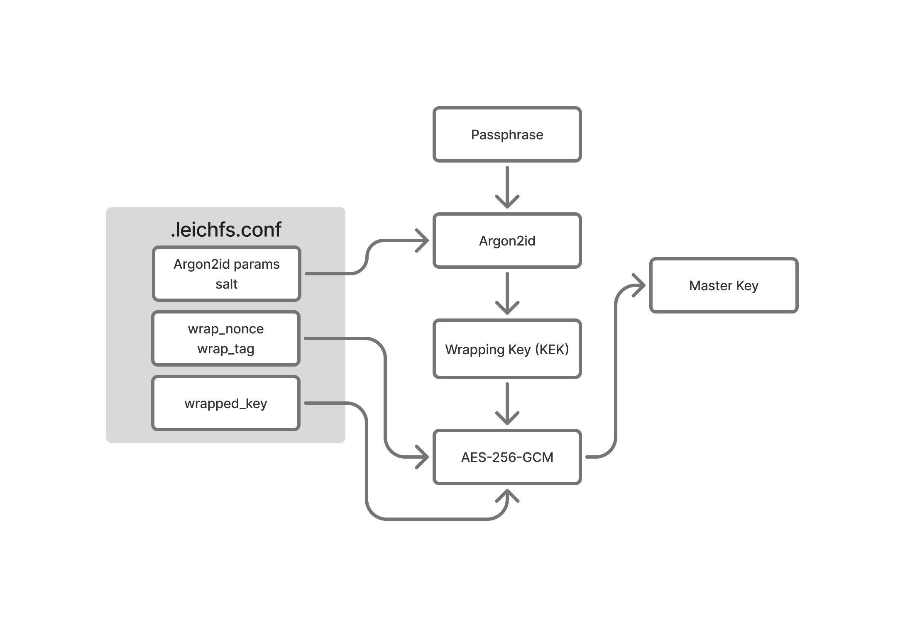

# Overview
An on-the-fly AES-256-GCM encrypted FUSE filesystem inspired by [gocryptfs](https://github.com/rfjakob/gocryptfs). Implemented in C++20 using RAII to ensure correct resource and key-material lifecycle management.

## Features

- Per-file key isolation
- Authenticated encryption with chunk level AAD
- Clean resource lifecycle management, thanks to RAII
- Passphrase-protected master key, similar to gocryptfs

## Limitations

- No forward secrecy
- No hard link support
- No metadata encryption
- No deniability features
- Only supported on Linux (FUSE3)

## Security
### Cryptographic design
#### Key management

LeichFS uses three-level key hierarchy to separate responsibilities and limit sensitive material exposure.

| Level | Name | Salt | Generation | Storage |
|---|---|---|---|---|
| 1 | Wrapping Key (KEK) | conf_salt from `.leichfs.conf` | Derived via Argon2id from passphrase + conf_salt at each init or mount  | Ephemeral - zeroed after use |
| 2 | Master Key | - | Generated by getrandom(2) once at init | AES-256-GCM wrapped in `.leichfs.conf` |
| 3 | File Key | file_salt from file header bytes 16-31 | Derived via HKDF-SHA256 ([RFC 5869](https://datatracker.ietf.org/doc/html/rfc5869)) from Master Key on each `open()` | Ephemeral - in `FH::file_key` zeroed on `close()`  |



#### Additional Authenticated Data (AAD)

Each chunk of ciphertext is authenticated with a 40-byte AAD, which costructed as:

```
AAD[40] = magic[8] || be32(version)[4] || be32(chunk_sz)[4] || salt[16] || be64(chunk_idx)[8]
```

This construction provide more security propertise:
- File binding: magic and salt bind the ciphertext to avoid chunk transplation
- Chunk position binding: chunk_idx prevents chunk reordering within a file

## Requirements 

- Linux kernel 5.6+ (uses `openat2`, `getrandom`, `renameat2`)
- FUSE 3.10+
- OpenSSL 3.0+
- libargon2

## License

See [LICENSE](LICENSE)
